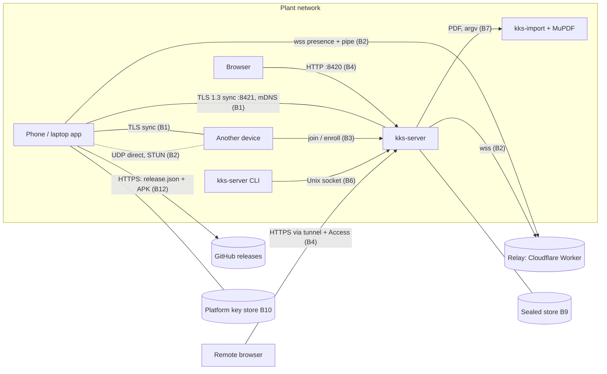

# Threat model: Walkdown
Tier: T3   Last reviewed: 2026-10-06   Reviewer: the fresh-context Claude review on PR #46 (the solo substitute, Gov §11); drafted by Claude from the code. The owner's own read is still due

Gov §4 requires this file to be updated, and the update reviewed, before merging any change that adds or moves a
trust boundary, changes authentication, authorization or sessions, stores or sends a new kind of sensitive data, or
adds a dependency with network, filesystem or native-code access.

Every mitigation below was checked by reading the code on 2026-10-05 (static reading: nothing was run or tested,
except that `staticFile` refuses `..` paths); file references are given where a reviewer would look.
"Open" means the control is missing or weaker than the decision records say, with its finding in the register.
"Accepted (00NN)" means a decision record accepted by the owner states the limit.

## Assets
- **The plant root key** (P-256): signs manager, device, rotate and revoke statements (PROTOCOL-v2 §8). Whoever holds
  it controls who belongs to the plant. Held by the server (a sealed store row) or a manager's laptop, plus an
  offline backup sealed with a passphrase (§20, 0023).
- **Device keys** (P-256, one per device, 0017) and the server's **custodial keys** (one per account): each signs
  that device's log entries; a stolen key writes as that person until revoked.
- **Account credentials:** Argon2id password hashes, sessions, setup, reset and invite tokens (server only).
- **Plant data:** the signed log (equipment, notes, links, tags, approvals), drawings, photos, procedures, courses.
  Confidential to the plant, not public.
- **Personal data:** names, usernames, positions, device labels (often host names), who was online when, photos
  that may show people, course progress (sealed per person, §13), diagnostics reports (sealed to the manager, §13a).
- **Integrity and availability of the history:** the log is the source of record (R11); a forged or lost entry
  breaks accountability.
- **Release signing keys** (`release.json.p256`, the MSIX certificate): whoever holds them can push an update that
  phones offer to install (0044).

## Actors
| Actor | Trusted? | Allowed to |
| --- | --- | --- |
| Manager | Yes | Everything in the plant: make admins, set relay/plant-name/diagnostics/plant-data settings, import drawings, hand over the manager role (root key). |
| Admin | Yes, within limits | Create members, approve or reject proposals, certify and revoke members' devices, make invites, export and import bundles. Cannot change the manager or other admins. |
| Member (role `user`) | Partly | Read all plant data; propose changes (they count only once approved, §11); vote, comment, withdraw own; manage own devices and profile. |
| A removed (revoked) device or person | No | Nothing new: syncs are `denied`, server sessions end. Keeps what it already had (Accepted (0020)). |
| Someone on the plant Wi-Fi/LAN | No | Reach the server's HTTP port and every device's sync port, see mDNS announcements. No plant data without a certified key or an account. |
| Someone on the internet | No | Reach the relay; reach the server only through the remote-access route the owner sets up (R19: a Cloudflare Tunnel with Access in `deploy/cloudflared-config.example.yml`). |
| The relay operator (Cloudflare, or whoever runs the Worker) | Not for data | Sees room IDs, peer IDs, who is online, connection timing and sizes, candidate addresses. Sync bytes pass through it TLS-encrypted end to end. |
| A compromised device (malware, stolen unlocked phone) | No | Everything its person may do, until revoked; reads everything that device holds. |
| A compromised dependency or build tool | No | Code execution in the app or server (supply chain; covered by the policy's dependency rules, not here). |

## Data flow and trust boundaries

Boundaries: **B1** LAN sync listener and discovery · **B2** relay, pipe and direct path · **B3** joining (invite QR,
lobby code, enroll, join-request file) · **B4** the server's HTTP API and pages · **B5** the web client in the
browser · **B6** the server's control socket · **B7** PDF import · **B8** content every device parses (photos, plant
data, courses) · **B9** stores at rest · **B10** keys and the root key backup · **B11** diagnostics reports · **B12**
updates · **B13** device removal and wipe · **B14** the platform layers (key stores, camera, file pickers, Android
components).

The web client (B4, B5):

CSP: none yet (issue #8)

The missing CSP fails WEB-8 (and WEB-7 cannot be met while the inline handlers of #18 remain). The Section 10
exception EX-1 covers it until 2027-01-03.

## Threats and mitigations
| Boundary | Threat (STRIDE) | Mitigation | Status |
| --- | --- | --- | --- |
| B1 sync | S: a stranger or another plant's device syncs | Mutual TLS, P-256 self-signed certs; the client pins the expected peer ID (`kksl/tls.nim` verifyPeer, `kksw/tls.nim:113`, Android `Net.kt:123`); the responder sends nothing unless the peer is a certified, unrevoked device (`sync.nim` offer → `mayRead`); different roots stop at hello | Mitigated |
| B1 sync | T: forged or altered entries, also relayed by third devices | Every entry verified against its chain key (`proto.nim` verifyEntry, `node.nim` ingest); only chains of certified devices kept; replay applies roles at each point (§10) | Mitigated |
| B1 sync | T: a cloned device key writes two histories (fork) | §4 says a fork cuts that device. `ingest` stores the second entry as evidence and passes it on (`node.nim:252-259`), but `rebuild` replays only the first chain it holds (`node.nim:87-97`), so no live node applies the cut and devices keep whichever chain reached them first | Open: #35 |
| B1 sync | I: downgrade to weak TLS | GnuTLS priority `NONE:+VERS-TLS1.3:+VERS-TLS1.2:+AES-GCM:+ECDHE-ECDSA…` and Android's suite list allow only TLS 1.3 or ECDHE-ECDSA-AES-GCM on 1.2. Schannel allows 1.2/1.3 with `SCH_USE_STRONG_CRYPTO` but no suite list (`kks_schannel.c:42-51`), so between two Windows 10 devices the 1.2 suite is Windows' default choice (unverified). TLS 1.2 is enabled on every platform, not only Windows 10 as §15 says | Mitigated, except the Schannel suite list: #41 |
| B1 sync | I: a stranger learns the plant | Before `denied` the responder sends its `hello` (root key, every device ID and last seq); mDNS TXT carries plant name, label, `adm` (§16) | Open: #68 |
| B1 sync | D: unauthenticated resource exhaustion | Gap in limits before the peer is authorized; details in a private advisory | Open, High: #67, [GHSA-wvvh-278h-8j58](https://github.com/5wHN28Dg/kks-explorer/security/advisories/GHSA-wvvh-278h-8j58) |
| B2 relay | S/I: the relay or a network attacker reads or alters sync data | The pipe carries the same pinned TLS session as the LAN (0038); the relay sees ciphertext only | Mitigated |
| B2 relay | I: presence traffic in clear | wss:// with system CAs and host name check on all three platforms (0038); but the manager's setting accepts `ws://` and clients follow it (`api.nim` `/api/settings/relay`, `Relay.kt:35`, `ws.nim:164`) | Open: #15 |
| B2 relay | S/D/I: any P-256 key enters a plant's room | The Worker checks only that the hello is signed by the key it names (`relay/src/index.js:85-98`), not that the key is a device of the plant. Anyone who knows the room ID (derived from the root ID: every past member, invite and bundle has it) can watch who is online, send signaling, and fill the room to 200 so the plant's devices get `room full` (`index.js:11,100`). Sync itself still fails at pinned TLS and `denied` | Open: #30 |
| B2 relay | S/D: a captured hello is replayed | Hellos are valid for ±300 s and not single-use (`index.js:88`); a replay replaces the real device's presence socket (`index.js:99-101`). Needs sight of the hello: the relay operator, or anyone in the `ws://` case (#15) | Open: #44 |
| B2 direct | T/D: punching to addresses a peer chose; a stalled direct path | Candidates ≤ 8 strings of ≤ 64 characters (Worker); TLS over the reliable-UDP stream with the same pinning; a stalled direct sync falls back to the pipe, that device stays on the pipe for an hour (`internet.nim`, `Internet.kt`) | Mitigated |
| B2 direct | D: memory exhaustion before TLS | The reliable-UDP receiver keeps every out-of-order datagram with any seq ahead of the next expected one, with no window limit (`rudp.nim:131-138`); anyone who knows the 8-byte session (the relay, the other peer) can grow it. The send side is capped (window 256, 4 MiB back-pressure) | Open: #36 |
| B3 join | S: someone else uses an invite (photo of the QR) | Token of 16 random bytes, 15 min, bound to the first device that uses it (`invites.nim`); the admin still sees the request and accepts or refuses it; the joiner pins the invite's `peer` | Mitigated (the admin's check is the control) |
| B3 join | S: a lobby request impersonates someone nearby | 6-digit code from both peer IDs shown on both screens (§16, `api.nim` join-requests); lobby ≤ 50, 15 min | Mitigated |
| B3 enroll | I/S: password stolen in transit; brute force | Enroll runs over TLS on the sync port (§16; GNOME/Windows `appstate.nim`, Android `Sync.kt:85`); server throttles per username and per source. Trust on first use of the server's peer ID | Mitigated, TOFU accepted in §16 |
| B3 enroll | S: per-source throttling bypassed | Over TLS the "source" key is the client's peer ID (`server.nim:481`): a new key per attempt avoids it; the per-username backoff still applies | Open: #39 |
| B3 enroll | I/S: legacy HTTP enroll | `/api/devices/enroll` (`server.nim:868-876`) takes a password over the HTTP port and certifies any not-yet-certified device ID with no proof that the caller holds its key. No current client calls it (Android `Net.enroll`, `Net.kt:200-212`, has no callers; desktops use TLS) | Open: #33 |
| B4 HTTP | I: web credentials exposed on the network | Gap in transport protection for the web pages on the plant network; details in a private advisory | Open, High: #26, [GHSA-m2gr-gcrf-xc6m](https://github.com/5wHN28Dg/kks-explorer/security/advisories/GHSA-m2gr-gcrf-xc6m) |
| B4 HTTP | S: password guessing | Argon2id (`argon2.nim`, m 19 MiB, t 2; 0023 planned 64 MiB, t 3), dummy hash for unknown users, backoff per username and per IP after 4 failures, up to 15 min (`server.nim:167-177`); in memory, so a restart clears it | Mitigated; parameters below 0023's plan: #40 |
| B4 HTTP | D: anyone locks an account | The per-username backoff applies from any address | Open: #39 |
| B4 HTTP | S: session theft or fixation | 32 random bytes, stored only as SHA-256 in sealed rows; cookie `HttpOnly; SameSite=Strict`; 30-day fixed expiry; ended on logout, password change/reset, role change, deactivation; refused when the account's device is revoked (`server.nim:179-189, 325-347`) | Mitigated |
| B4 HTTP | T: CSRF | SameSite=Strict, JSON-only POSTs (PDF and bundle uploads use types a form can't send), Origin compared with Host/public URL when present (`server.nim:785-812`) | Mitigated |
| B4 HTTP | E: role checks | Role from the replayed log (`api.nim` `need`); admin/manager routes listed in the code; but `/api/sync/now` (`server.nim:996-1007`) has no role check: any member makes the server connect to any host:port and reads the error (port probing from the server) | Open: #32 |
| B4 HTTP | E: script injection through stored content | Gap in how stored member content is served to browsers; details in a private advisory | Open until #45 merges, High: #25, [GHSA-f86j-phv6-36c6](https://github.com/5wHN28Dg/kks-explorer/security/advisories/GHSA-f86j-phv6-36c6) |
| B4 HTTP | D: unauthenticated resource exhaustion | Gap in request-size limits before authentication; details in a private advisory | Open, High: #27, [GHSA-xfj6-p785-whg5](https://github.com/5wHN28Dg/kks-explorer/security/advisories/GHSA-xfj6-p785-whg5) |
| B4 HTTP | E: the setup link | 24 random bytes, hashed, 7 days, single use, only while there is no manager; printed to stdout (the journal) at each start | Mitigated; the copy in the journal: #69 |
| B4 HTTP | I: path traversal | `staticFile` normalizes `..` and checks the prefix (`server.nim:384-387`); symlinks inside served folders are followed (the folders are the server's own) | Mitigated |
| B5 web | E: script injection in pages | Every value in the 40 HTML sinks goes through `K.esc`/`esc` (escapes `& < > " '`); no script from another origin; session cookie HttpOnly; `X-Frame-Options: DENY`, `nosniff`, `Referrer-Policy: no-referrer`. No CSP behind them | Open: #7, #8, #16, #17, #18 (exceptions EX-1 to EX-3, accepted until 2027-01-03) |
| B5 web | I: data left on a shared browser | Plant data cached by the service worker (HTTPS only) and an outbox in IndexedDB; logout deletes the data cache and the session store, keeps queued changes per user (`common.js` K.wipe); offline use limited to `offline_days` | Accepted (N1a: browser storage is as safe as the browser) |
| B6 control | E: another local user drives the server | `kks-server.sock` created 0600 (umask 0177) next to the store; one JSON line ≤ 64 KiB; five commands (`server.nim:516-602`). No peer-credential check: same-user processes are trusted | Mitigated (same-user trust as B9) |
| B7 import | E: a crafted PDF exploits MuPDF | Manager only, `%PDF-` check, size cap; MuPDF 1.28.2 pinned by SHA-256 (`importer/fetch_mupdf.sh`); PDF JavaScript never enabled; argv without a shell. But kks-import runs as the server's user with no timeout, rlimit or sandbox (`server.nim:650-699`), and the user-service install has only `NoNewPrivileges`/`PrivateTmp` (`install-server-user.sh`), so a compromise reaches the store, the root key and whatever else that account holds | Open: #34 |
| B7 import | T: options smuggled in the sheet name | The name is a positional argument parsed by `parseopt` (`importer/kks_import.nim:73`); a name starting with `--` is read as an option. Manager only | Open: #38 |
| B8 content | E/D: a crafted JPEG XL photo | Any member can propose a photo; every device decodes it with libjxl (Windows and Android pinned by SHA-256 to v0.12.0 sources; Flatpak from the GNOME runtime; web in WebAssembly). Android and web refuse > 100 MP before allocating; Windows `kks_d2d.cpp` allocates `w×h×4` with no cap | Mitigated, except the Windows size cap: #37 |
| B8 content | T: plant data and courses | Published as a manager `setting` with file hashes (§19); files are blobs checked against their hash; paths restricted; strict JSON; path store size limits (`pathstore.nim`); courses rendered with `textContent` | Mitigated |
| B8 content | E: a course link with a script scheme | The course validator allows only `https://` links (`courses.nim`), but it runs only for `/api/courses`; `course.js:44` puts `to.url` into `href` unchecked, and `/data/courses/*.json` is served as published. Needs the manager to publish it | Open: #42 |
| B9 at rest | I: a copied disk or database | Every row, entry and blob AES-256-GCM sealed, the table and row in the associated data (`kksl/dbstore.nim`); clear: entry IDs, peer IDs, seqs, blob hashes. Storage key: systemd-creds (TPM2) on the server, the login keyring on GNOME, DPAPI on Windows, an AndroidKeyStore AES key on Android (0020) | Mitigated |
| B9 at rest | I: same-user programs on desktops | The keyring and DPAPI belong to the account, not the app | Accepted (0020) |
| B9 backups | I: backups in clear | `kks-server backup` writes an unencrypted bundle with photos and never sets its mode (`kks_server.nim:109-112`; `export-root-key` sets 0600 at `:107`); `/api/bundle` (admin) downloads the same. 0020 point 4 says server backups are encrypted to the backup key; no code does that. The server's plant-data working copy, sheet backups and uploaded PDFs are plain files too (`server.nim:632-645, 716-719`), where 0020 point 3 lists plant-data files on disk as encrypted | Open: #28 |
| B10 keys | I: device key theft | Android: non-exportable AndroidKeyStore key (`Keys.kt`); Windows: non-exportable CNG software key (`appstate.nim`, `provider_cng.nim`); GNOME and the server: the scalar in a sealed row | Mitigated (GNOME/server: as strong as B9) |
| B10 root key | I: the offline backup is guessed | PBKDF2-SHA256 ≥ 600 000 iterations + AES-GCM (`extras.nim:83-97`); 0023 requires a generated passphrase of ≥ 6 words (~77 bits) or an entropy check, but the server CLI, GNOME and Windows accept any 12 characters (`kks_server.nim:97-98`, `apps/gnome/src/kksg/manage.nim:311`, `apps/windows/src/kkswin/manage.nim:341`). The GNOME and Windows files are written with the default mode | Open: #29 |
| B10 root key | E: server compromise | The server holds the root key and every account's custodial key (sealed rows), so whoever runs code as its user can sign anything; `reset-manager` uses it by design | Open: #70 (the server is the plant's always-on node, 0026; depends on the B7 and B4 fixes) |
| B11 diagnostics | I: reports leak data | ECIES to the manager's report key (§13a); the server can't read them; no plant data or passwords by rule; ≤ 1 per 6 h, ≤ 32 KB. Server 500s record path and stack trace | Mitigated |
| B12 updates | T: a malicious APK offered | `release.json` signed with a pinned P-256 key over a domain string, APK checked against SHA-256 and size, only newer versions, Android's installer checks the signing certificate and asks the person (`sync/Updates.kt`, 0044). Desktop apps don't update themselves | Mitigated (the key's custody: see B7, B10) |
| B13 removal | S: a fake "you are removed" wipes a device | The `revoked` entry must verify and name this device, by a certified admin, manager or same-person device (§15, `node.nim` acceptRevocation) | Mitigated |
| B13 removal | E: an admin wipes the manager's or another admin's device | `acceptRevocation` (`node.nim:188-204`) accepts a revoke by any admin, as §15 says, but replay lets an admin revoke only devices of `user` persons (`replay.nim:516-522`). A malicious admin's device can deny a sync and present such a revoke: the manager's device wipes itself, its root key row included, although replay ignores the revoke | Open: #31 |
| B13 removal | I: a removed device keeps its data | It gets nothing new and wipes itself when it reconnects (store rows overwritten with `secure_delete`, Android key aliases deleted) | Accepted (0020, R13) |
| B14 platform | E: other apps on a phone | Release builds export only the launcher activity; FileProvider and the update receiver are not exported; `allowBackup=false`; no clear text. Debug and rehearsal builds export four test receivers with no permission (one overrides the update key: `src/debug/kotlin/.../DebugUpdateReceiver.kt`) | Mitigated in release; debug/rehearsal builds must never go on a phone with real data |
| B14 platform | I: camera and files | Camera through the portal (GNOME), Media Foundation (Windows), the CAMERA permission (Android); frames stay in memory for QR decoding; files only through the platform's pickers | Mitigated |

## Failure behavior
Walkdown controls no equipment, so the OTH-7/OTH-10 table is not applicable. Relevant failure rules:
- A wrong storage key fails at open (`dbstore` probe row); a damaged key store means the device re-syncs (0020).
- Entries that don't verify are ignored and reported, never applied; a removed device wipes only after verifying the
  revoke entry.
- A failed signature or hash check offers no update; a failed direct path falls back to the relay; with no relay,
  LAN sync and offline work go on (R15).

## Out of scope
- Someone with the unlocked device using the app as its owner (N1a), and malware running as the same desktop user.
- A compromised operating system, platform key store, TLS stack or CPU.
- Forensic recovery of data a removed device held before it was wiped.
- Physical attacks on the server machine or its TPM.
- Denial of service from someone with full control of the plant network or the internet path, beyond the limits
  listed above.
- The plant's remote-access route itself (Cloudflare Tunnel and Access policy): set up and governed by the owner.
- The CI and supply chain: covered by the policy's dependency and CI rules (Gov §5, DEP-*).
